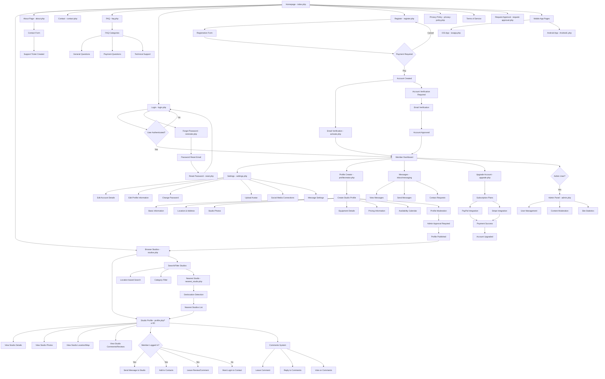

# Old Voiceover Studio Finder - Site Roadmap & User Flow Analysis

## 🎯 Site Overview
**Business Model**: Public browsing with paid membership for profile creation
- **Public Access**: Browse all studios, view profiles, search functionality
- **Member Access**: Create/edit profiles, messaging, contact features
- **Payment Required**: To create account and studio profile

---

## 📊 Mermaid Flow Diagram



---

## 🚪 Access Control Matrix

| Feature/Page | Public Access | Member Access | Premium Member | Admin |
|--------------|---------------|---------------|----------------|-------|
| **Browse Studios** | ✅ Full | ✅ Full | ✅ Full | ✅ Full |
| **View Profiles** | ✅ Full | ✅ Full | ✅ Full | ✅ Full |
| **Search/Filter** | ✅ Full | ✅ Full | ✅ Full | ✅ Full |
| **Create Account** | ❌ Pay Required | ✅ | ✅ | ✅ |
| **Create Profile** | ❌ | ✅ Limited | ✅ Full | ✅ Full |
| **Send Messages** | ❌ | ✅ | ✅ | ✅ |
| **Leave Comments** | ❌ | ✅ | ✅ | ✅ |
| **Upload Photos** | ❌ | ✅ Limited | ✅ Unlimited | ✅ |
| **Admin Panel** | ❌ | ❌ | ❌ | ✅ |

---

## 📁 Key File Structure

### **Core Pages**
- `index.php` - Homepage with featured studios
- `studios.php` - Main studio directory/listing
- `profile.php` - Individual studio profile pages
- `login.php` / `register.php` - Authentication
- `settings.php` - User account management
- `profilecreator.php` - Studio profile creation/editing

### **Authentication System**
- `app/init.php` - Application bootstrap
- `app/models/User.php` - User model with metadata
- `activate.php` - Email verification
- `reminder.php` / `reset.php` - Password recovery

### **Communication Features**
- Message system (inbox functionality)
- Contact request system
- Comments/review system
- Social media integration

### **Payment Integration**
- PayPal integration
- Subscription management
- Account upgrade system

### **Database Tables** (from SQL dump)
- `users` - User accounts
- `usermeta` - User profile data
- `comments` - Review/comment system
- `contacts` - User connections
- `messages` - Private messaging
- `subscriptions` - Payment tracking

---

## 🎯 Key Business Logic

### **Registration Flow**
1. User visits site → Can browse freely
2. Wants to create profile → Must register
3. Registration requires payment
4. Email verification required
5. Profile creation after verification
6. Admin approval for profile visibility

### **Studio Discovery**
1. Public users can browse all studios
2. Location-based search available
3. Category/filter system
4. Map integration for location
5. Featured studios on homepage

### **Member Benefits**
- Create studio profile
- Upload photos/media
- Receive messages from potential clients
- Leave reviews/comments
- Connect with other studios
- Access to mobile app features

### **Revenue Model**
- Paid membership for profile creation
- Subscription-based access
- Premium features for enhanced profiles
- Mobile app integration

---

## 🔄 User Journey Flows

### **Public Visitor Journey**
```
Homepage → Browse Studios → View Profile → Contact (Requires Login) → Register (Pay) → Create Profile
```

### **Member Journey**
```
Login → Dashboard → Edit Profile → Manage Messages → Update Settings → Upgrade Account
```

### **Studio Owner Journey**
```
Register (Pay) → Verify Email → Create Profile → Add Photos → Set Availability → Receive Bookings
```

---

## 📱 Technical Architecture

### **Frontend**
- PHP-based server-side rendering
- jQuery for interactions
- Bootstrap/custom CSS
- Google Maps integration
- Mobile-responsive design

### **Backend**
- Custom PHP framework (Hazzard)
- MySQL database
- File upload system
- Email notification system
- OAuth social login integration

### **Third-Party Integrations**
- PayPal payments
- Google Maps API
- Social media OAuth
- Email services
- Mobile app support

---

## 🎨 Key Design Patterns

### **Public-First Approach**
- All content visible to public
- Registration only for interaction
- SEO-optimized profile pages
- Social sharing integration

### **Pay-to-Participate Model**
- Free browsing encourages discovery
- Payment barrier for quality control
- Member verification process
- Premium feature tiers

### **Community Features**
- Comments and reviews
- User connections/networking
- Message system
- Social proof elements

---

This roadmap shows the old site operated on a **"Browse Free, Pay to Participate"** model where anyone could discover studios, but creating profiles and interacting required paid membership. The focus was on public discovery with monetization through profile creation fees.
