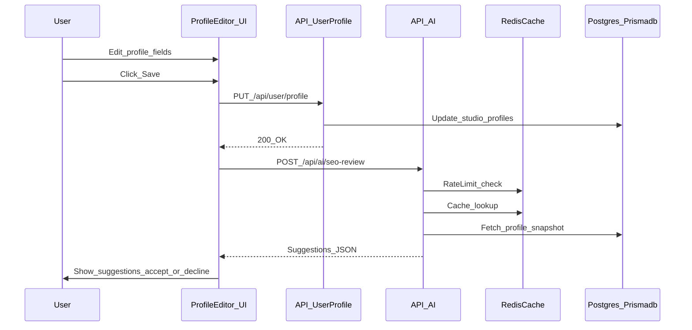

## Goal

Add AI features focused on:

- **SEO suggestions on profile save** (generate recommendations + user accepts/declines)
- **Auto-generate text for profile fields** (`short_about`, `about`)

Keep it safe (no hallucinated claims), controllable (user approval), and cost-bounded (rate limits + caching).

## Recommendation: which LLM to use (with tradeoffs)

### Default approach

- **Implement a provider-agnostic LLM adapter** (OpenAI/Anthropic/Gemini compatible), then pick a default provider/model via env.
- For v1, favor a **fast, cost-efficient "mini/sonnet/flash" class model** for drafts/suggestions, with an optional **fallback to a stronger model** when output validation fails or for premium users/admin.

### Provider considerations (high signal)

- **OpenAI**
  - **Pros**: Very strong developer ergonomics; good structured output support; consistent tool/function calling.
  - **Cons**: Cost can climb at scale; vendor lock-in risk if not abstracted.
- **Anthropic (Claude)**
  - **Pros**: Often excellent writing quality; strong safety posture; good long-context behavior.
  - **Cons**: Structured output can require more careful validation/retries depending on model/version.
- **Google (Gemini)**
  - **Pros**: Competitive latency/cost options; strong ecosystem if you already rely on Google services.
  - **Cons**: SDK/API surface differences may require more integration effort.

### Why abstraction matters here

SEO suggestions + field drafting are **promptable**, not deeply model-specific. An adapter lets you A/B models later, negotiate price, and add a fallback provider without touching UI/business logic.

## What we discovered in the repo (integration points)

- **Profile editing saves via** `PUT /api/user/profile` from `src/components/dashboard/ProfileEditForm.tsx`.
- **Profile page SEO metadata is assembled in** `src/app/[username]/page.tsx `via `generateMetadata`.
- **Redis caching utilities exist** (`src/lib/cache.ts`) and can be reused for rate limiting/caching AI results.

## Proposed architecture

### New capabilities

1) **Field draft generation**

- "Generate" buttons next to `short_about` and `about` fields.
- Inputs: studio name, location, services, existing text, tone, length.
- Output: draft text + optional bullet "why this works".

2) **SEO review after save (suggest + accept/decline)**

- After a successful profile save:
  - kick off an **AI SEO review job**
  - show a non-blocking toast "SEO suggestions ready" (or a small badge)
- Suggestions are presented as a diff: title/description/keywords + content improvements.

### Data handling and safety guardrails

- **No silent publishing**: AI never modifies public content without user action.
- **No new factual claims**: prompt + validator enforce "only rephrase/organize what user provided".
- **PII minimization**: only send fields needed for the task; avoid sending email or internal IDs.
- **Output validation**: enforce a strict Zod schema; retry once with "fix JSON" prompt if invalid.

### Storage (suggested)

Add a small Prisma model to store drafts/suggestions for auditability and "resume later" UX:

- `ai_suggestions`: user_id, studio_id, kind, input_snapshot, output, status (PENDING/APPLIED/DISMISSED), created_at, applied_at.

If you want zero schema change for MVP, store results in Redis keyed by user/session and expire quickly; promote to DB once the flow proves valuable.

### Rate limiting & caching

- Per-user limits (e.g., per hour/day) via Redis counters.
- Cache identical requests (hash of inputs) for a short TTL to reduce repeated cost.

## UX plan (shadcn/ui)

- **Inline "Generate" button** near each text area.
- **Dialog** showing:
  - draft text
  - "Insert into field" / "Try again" / "Cancel"
  - tone + length selectors
- **SEO suggestions panel** after save:
  - show current computed SEO values
  - suggested replacements
  - accept/decline per item

## Implementation sketch (key files)

### Backend

- Add `src/lib/ai/`:
  - `src/lib/ai/client.ts`: provider selection + shared request helpers
  - `src/lib/ai/prompts/seo.ts`: prompt builder for SEO review
  - `src/lib/ai/prompts/fields.ts`: prompt builder for field drafting
  - `src/lib/ai/schemas.ts`: Zod schemas for structured output
- Add API routes:
  - `src/app/api/ai/field-draft/route.ts`
  - `src/app/api/ai/seo-review/route.ts`
- Reuse cache utilities:
  - `src/lib/cache.ts` for rate limiting + caching

### SEO refactor (recommended)

- Extract SEO building logic from `src/app/[username]/page.tsx` into:
  - `src/lib/seo/profile.ts` (single source of truth)
- Then:
  - `generateMetadata` calls `buildProfileMetadata(...)`
  - AI SEO review uses the same function to show "current SEO" values to the user

### Frontend

- Extend `src/components/dashboard/ProfileEditForm.tsx`:
  - add "Generate" actions for `short_about` and `about`
  - after successful save, trigger `/api/ai/seo-review` asynchronously
  - add a suggestions UI component (new file under `src/components/dashboard/`)

## Data flow (v1)

## Phase rollout

- **Phase 0 (research/spike)**: implement adapter + one endpoint + local prompt eval on a small anonymized dataset.
- **Phase 1 (MVP)**: inline field drafting for `short_about` and `about`.
- **Phase 2 (SEO suggestions)**: after-save SEO review + diff UI + acceptance writes.
- **Phase 3 (quality + ops)**: rate limits, caching, telemetry, admin analytics, A/B tests.
- **Future**: bulk standardization (owner-opt-in), admin studio discovery (prefer official APIs like Google Places; avoid scraping images without license).

## Acceptance criteria

- Users can generate drafts for `short_about` and `about` and insert them.
- After saving profile, user receives SEO suggestions and can accept/decline.
- Outputs are schema-validated; failures degrade gracefully.
- Per-user rate limiting prevents abuse and cost overruns.

## Key risks & mitigations

- **Hallucinations / false claims**: strict prompt constraints + validation + UI review.
- **SEO spam/keyword stuffing**: add rules, cap keyword density, prefer natural language.
- **Cost creep**: rate limits + caching + "generate" on explicit action + optional premium tier.
- **Compliance**: do not scrape copyrighted images for future admin discovery; use official APIs and store provenance.
