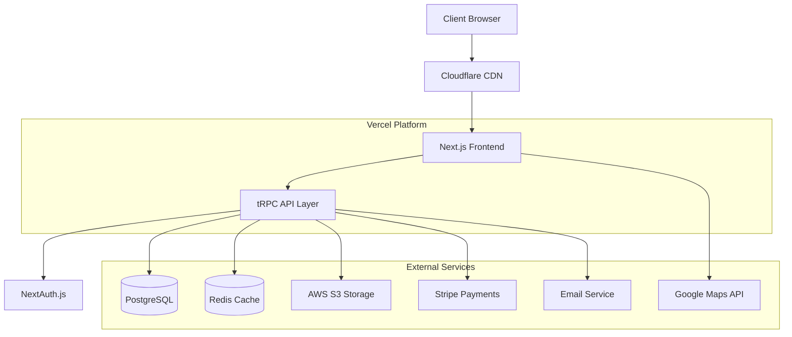

# VoiceoverStudioFinder Modern - Product Requirements Document

**Version**: 1.0  
**Date**: January 3, 2025  
**Status**: Draft  
**Authors**: Development Team  
**Stakeholders**: Client, Development Team, End Users

---

## Executive Summary

This PRD outlines the complete modernization of VoiceoverStudioFinder.com, transforming a legacy PHP-based studio directory into a modern, scalable, and performant web application. The project involves recreating the existing functionality with identical visual design while implementing modern technologies, security standards, and performance optimizations.

### Project Goals

- **Preserve**: Exact visual design, user experience, and core functionality
- **Modernize**: Technology stack, security, performance, and maintainability
- **Enhance**: Mobile experience, accessibility, SEO, and scalability
- **Migrate**: All existing data, user accounts, and content seamlessly

---

## Product Overview

### Current State Analysis

**Existing Platform**: VoiceoverStudioFinder.com

- **Technology Stack**: PHP, MySQL, jQuery 1.11.1, Bootstrap 3.0.3, Font Awesome 4.0.3
- **Core Function**: Directory service for voiceover studios and talent
- **Business Model**: £25/year premium listings with enhanced features
- **User Base**: Studios, voiceover artists, clients seeking studios

### Critical Issues Identified

1. **Security Vulnerabilities**: Outdated libraries (jQuery 1.11.1 from 2014)
2. **Performance**: Poor mobile experience, slow load times, no optimization
3. **Maintenance**: Legacy codebase difficult to maintain and extend
4. **Scalability**: Monolithic architecture limits growth potential
5. **User Experience**: Desktop-first design, poor mobile usability

### Business Impact

- **Risk**: Security vulnerabilities expose user data and payment information
- **Opportunity**: Modern platform will improve user engagement and conversion rates
- **Competitive Advantage**: Enhanced mobile experience and performance

---

## Target Audience

### Primary Users

#### 1. Studio Owners (Premium Users)

- **Demographics**: Professional recording studio operators, voiceover artists with home studios
- **Goals**: Attract new clients, showcase facilities, manage bookings
- **Pain Points**: Limited online visibility, outdated profile management
- **Technical Proficiency**: Basic to intermediate
- **Usage Patterns**: Weekly profile updates, monthly performance reviews

#### 2. Voiceover Artists (Free/Premium Users)

- **Demographics**: Professional voice talent, freelancers, agencies
- **Goals**: Find nearby studios, book recording sessions, network
- **Pain Points**: Difficult studio search, poor mobile experience
- **Technical Proficiency**: Basic to intermediate
- **Usage Patterns**: Project-based searches, location-specific queries

#### 3. Clients/Agencies (Searchers)

- **Demographics**: Marketing agencies, corporate clients, producers
- **Goals**: Find suitable studios quickly, compare facilities, book sessions
- **Pain Points**: Complex search interface, lack of detailed information
- **Technical Proficiency**: Basic
- **Usage Patterns**: Sporadic searches when projects require studio work

### Secondary Users

#### 4. Site Administrators

- **Role**: Manage platform, moderate content, handle payments
- **Goals**: Efficient user management, system monitoring, revenue tracking
- **Technical Proficiency**: Advanced

---

## Current System Analysis

### Database Schema (From cl59-theshows2.sql)

#### Core Tables Identified:

1. **users** - User accounts and profiles
2. **comments** - Studio reviews and feedback
3. **contacts** - User connections and networking
4. **messages** - Private messaging system
5. **payments** - Subscription and payment tracking
6. **uploads** - File management for images/assets

### Existing Features Analysis

#### Core Functionality (Must Preserve)

1. **User Registration & Authentication**
   - Social login (Twitter, Facebook)
   - Email verification system
   - Password reset functionality

2. **Studio Profiles**
   - Detailed studio information
   - Image galleries
   - Contact details and website links
   - Geographic location data
   - Equipment and service descriptions

3. **Search & Discovery**
   - Location-based search with Google Maps
   - Filter by studio type (Recording, Podcast, Home, etc.)
   - Filter by services (ISDN, Source Connect, etc.)
   - Distance-based results

4. **Premium Features**
   - Featured studio listings
   - Enhanced profile options
   - Premium placement in search results
   - Annual subscription (£25/year)

5. **Social Features**
   - Studio reviews and comments
   - Private messaging between users
   - User connections/networking
   - Social media integration

6. **Content Management**
   - User-generated content
   - Image upload and management
   - Profile editing capabilities

### Technical Architecture (Current)

#### Frontend (Legacy)

- **HTML**: Server-rendered PHP templates
- **CSS**: Bootstrap 3.0.3 + custom styles (Raleway font family)
- **JavaScript**: jQuery 1.11.1, custom scripts
- **Maps**: Google Maps JavaScript API
- **Theme**: Yellow color scheme, geometric backgrounds

#### Backend (Legacy)

- **Language**: PHP with custom framework
- **Database**: MySQL (MariaDB 10.4.17)
- **Session Management**: PHP sessions with custom auth
- **File Uploads**: Direct server storage
- **Email**: PHP mail system
- **Payment**: Likely Stripe or PayPal integration

#### Infrastructure (Inferred)

- **Hosting**: Shared hosting (ExtendCP)
- **Domain**: voiceoverstudiofinder.com
- **SSL**: Basic SSL certificate
- **CDN**: None identified
- **Monitoring**: Basic server logs

---

## Technology Requirements

### Recommended Modern Stack

#### Frontend Architecture

- **Framework**: Next.js 14 with App Router
- **Language**: TypeScript for type safety
- **Styling**: Tailwind CSS for utility-first styling
- **UI Components**: Headless UI + custom components
- **State Management**: Zustand for client state
- **Forms**: React Hook Form with Zod validation
- **Maps**: Next.js compatible Google Maps integration

#### Backend Architecture

- **Runtime**: Node.js 20 LTS
- **Framework**: Next.js 14 API routes + tRPC for type-safe APIs
- **Database**: PostgreSQL 15 with Prisma ORM
- **Authentication**: NextAuth.js with multiple providers
- **File Storage**: AWS S3 or Cloudinary for images
- **Email**: Resend or SendGrid for transactional emails
- **Payment**: Stripe for subscription management

#### Infrastructure & DevOps

- **Hosting**: Vercel for frontend, Railway/Render for database
- **CDN**: Vercel Edge Network + Cloudflare
- **Monitoring**: Sentry for error tracking, Vercel Analytics
- **CI/CD**: GitHub Actions with automated testing
- **Environment**: Docker for local development consistency

#### Performance & Security

- **Image Optimization**: Next.js Image component with WebP/AVIF
- **Code Splitting**: Automatic with Next.js App Router
- **Caching**: Redis for session storage and caching
- **Security**: CSRF protection, rate limiting, input validation
- **SEO**: Next.js built-in SEO optimization

---

## Functional Requirements

### Core Features (MVP - Phase 1)

#### FR-001: User Authentication System

**Priority**: High  
**Description**: Secure user registration, login, and account management

**Acceptance Criteria**:

- [ ] Users can register with email and password
- [ ] Email verification required for account activation
- [ ] Social login with Google, Twitter, Facebook
- [ ] Password reset via email
- [ ] Secure session management
- [ ] Two-factor authentication (optional)
- [ ] GDPR-compliant data handling

**Technical Requirements**:

- NextAuth.js implementation
- JWT tokens with refresh mechanism
- Encrypted password storage (bcrypt)
- Rate limiting for login attempts

#### FR-002: Studio Profile Management

**Priority**: High  
**Description**: Comprehensive studio profile creation and management

**Acceptance Criteria**:

- [ ] Studio owners can create detailed profiles
- [ ] Upload multiple images (gallery)
- [ ] Add equipment lists and service descriptions
- [ ] Set geographic location with map integration
- [ ] Specify studio type and services offered
- [ ] Contact information and website links
- [ ] Preview mode before publishing
- [ ] Draft/published status management

**Technical Requirements**:

- Image upload with automatic optimization
- Google Maps Places API integration
- Form validation with error handling
- Progressive image loading

#### FR-003: Advanced Search & Discovery

**Priority**: High  
**Description**: Powerful search functionality with multiple filters

**Acceptance Criteria**:

- [ ] Location-based search with radius selection
- [ ] Filter by studio type (Recording, Podcast, Home, etc.)
- [ ] Filter by services (ISDN, Source Connect, Cleanfeed, etc.)
- [ ] Text search by name or description
- [ ] Sort by distance, rating, or premium status
- [ ] Map view with studio markers
- [ ] List view with pagination
- [ ] Save search preferences
- [ ] Mobile-optimized search interface

**Technical Requirements**:

- Elasticsearch for full-text search
- Google Maps JavaScript API v3+
- Debounced search input
- Responsive design patterns

#### FR-004: Premium Subscription System

**Priority**: High  
**Description**: Payment processing for premium studio listings

**Acceptance Criteria**:

- [ ] £25/year subscription model
- [ ] Secure payment processing (Stripe)
- [ ] Automatic subscription renewal
- [ ] Payment history and invoicing
- [ ] Subscription status management
- [ ] Grace period for expired subscriptions
- [ ] Refund processing capability
- [ ] VAT handling for UK/EU customers

**Technical Requirements**:

- Stripe integration with webhooks
- Subscription lifecycle management
- Automated email notifications
- Financial reporting dashboard

### Enhanced Features (Phase 2)

#### FR-005: Review & Rating System

**Priority**: Medium  
**Description**: User reviews and ratings for studios

**Acceptance Criteria**:

- [ ] Users can leave reviews and ratings (1-5 stars)
- [ ] Review moderation system
- [ ] Response capability for studio owners
- [ ] Aggregate rating display
- [ ] Review helpfulness voting
- [ ] Anonymous review option
- [ ] Review reporting for inappropriate content

#### FR-006: Messaging System

**Priority**: Medium  
**Description**: Private messaging between users

**Acceptance Criteria**:

- [ ] Real-time messaging interface
- [ ] Message history and search
- [ ] File attachment support
- [ ] Read receipts and typing indicators
- [ ] Block/report user functionality
- [ ] Message encryption for privacy

#### FR-007: Booking & Calendar Integration

**Priority**: Medium  
**Description**: Studio booking and availability management

**Acceptance Criteria**:

- [ ] Studios can set availability calendars
- [ ] Users can request bookings
- [ ] Booking confirmation workflow
- [ ] Calendar integration (Google/Outlook)
- [ ] Automated reminder emails
- [ ] Booking status tracking

### Advanced Features (Phase 3)

#### FR-008: Mobile Application

**Priority**: Low  
**Description**: Native mobile app for iOS and Android

**Acceptance Criteria**:

- [ ] React Native or Flutter implementation
- [ ] Feature parity with web application
- [ ] Push notifications for messages/bookings
- [ ] Offline map caching
- [ ] App store deployment

#### FR-009: Analytics Dashboard

**Priority**: Low  
**Description**: Comprehensive analytics for studio owners

**Acceptance Criteria**:

- [ ] Profile view statistics
- [ ] Search appearance tracking
- [ ] Conversion rate monitoring
- [ ] Geographic analysis of visitors
- [ ] Export capabilities for data

---

## Non-Functional Requirements

### Performance Requirements

#### NFR-001: Page Load Performance

- **Requirement**: 95% of pages load in <2 seconds on 3G connections
- **Measurement**: Lighthouse Performance Score >90
- **Implementation**: Code splitting, image optimization, CDN usage

#### NFR-002: Core Web Vitals

- **Largest Contentful Paint (LCP)**: <2.5 seconds
- **First Input Delay (FID)**: <100 milliseconds
- **Cumulative Layout Shift (CLS)**: <0.1
- **Implementation**: Next.js optimization, critical CSS inlining

#### NFR-003: Database Performance

- **Requirement**: 95% of database queries execute in <100ms
- **Implementation**: Proper indexing, query optimization, connection pooling

### Security Requirements

#### NFR-004: Data Protection

- **Requirement**: GDPR compliance for EU users
- **Implementation**: Data encryption, user consent management, deletion rights

#### NFR-005: Authentication Security

- **Requirement**: Industry-standard authentication security
- **Implementation**: OAuth 2.0, JWT tokens, rate limiting, 2FA support

#### NFR-006: Payment Security

- **Requirement**: PCI DSS compliance for payment processing
- **Implementation**: Stripe integration, no card data storage

### Scalability Requirements

#### NFR-007: User Capacity

- **Requirement**: Support for 10,000+ concurrent users
- **Implementation**: Horizontal scaling, load balancing, CDN

#### NFR-008: Data Growth

- **Requirement**: Handle 1M+ studio listings and user profiles
- **Implementation**: Database sharding, efficient indexing

### Availability Requirements

#### NFR-009: Uptime

- **Requirement**: 99.9% uptime (8.76 hours downtime/year maximum)
- **Implementation**: Redundant infrastructure, monitoring, automated failover

#### NFR-010: Backup & Recovery

- **Requirement**: Daily automated backups with 4-hour RTO
- **Implementation**: Automated database backups, disaster recovery plan

### Usability Requirements

#### NFR-011: Mobile Responsiveness

- **Requirement**: Fully functional on devices from 320px to 4K displays
- **Implementation**: Responsive design, mobile-first approach

#### NFR-012: Accessibility

- **Requirement**: WCAG 2.1 AA compliance
- **Implementation**: Semantic HTML, ARIA labels, keyboard navigation

#### NFR-013: Browser Support

- **Requirement**: Support for last 2 versions of major browsers
- **Browsers**: Chrome, Firefox, Safari, Edge
- **Implementation**: Progressive enhancement, polyfills

---

## User Stories & Use Cases

### Epic 1: Studio Discovery

#### US-001: Location-Based Studio Search

**As a** voiceover artist  
**I want to** search for studios within a specific distance from my location  
**So that** I can find convenient recording options for my projects

**Acceptance Criteria**:

- [ ] Given I'm on the search page, when I enter my location, then I can select a radius (5, 10, 25, 50 miles)
- [ ] Given I've set location and radius, when I search, then I see studios sorted by distance
- [ ] Given search results are displayed, when I view them on a map, then I can see studio locations with accurate markers

#### US-002: Advanced Filtering

**As a** client looking for a specific type of studio  
**I want to** filter search results by studio type and available services  
**So that** I can quickly find studios that meet my project requirements

**Acceptance Criteria**:

- [ ] Given I'm searching for studios, when I apply filters, then results update in real-time
- [ ] Given I want specific services, when I select multiple filters, then only studios matching ALL criteria are shown
- [ ] Given I've applied filters, when I bookmark the page, then my filters are preserved in the URL

### Epic 2: Studio Management

#### US-003: Profile Creation

**As a** studio owner  
**I want to** create a comprehensive profile for my studio  
**So that** potential clients can discover and learn about my services

**Acceptance Criteria**:

- [ ] Given I'm a registered user, when I create a studio profile, then I can add multiple photos, descriptions, and contact information
- [ ] Given I'm creating my profile, when I set my location, then it's accurately displayed on the map
- [ ] Given I want to attract clients, when I publish my profile, then it becomes searchable immediately

#### US-004: Premium Subscription

**As a** studio owner  
**I want to** subscribe to premium features  
**So that** my studio gets enhanced visibility and features

**Acceptance Criteria**:

- [ ] Given I want premium features, when I subscribe, then my payment is processed securely
- [ ] Given I'm a premium subscriber, when users search, then my studio appears in featured results
- [ ] Given my subscription expires, when I login, then I'm notified and can easily renew

### Epic 3: User Communication

#### US-005: Studio Messaging

**As a** potential client  
**I want to** message studio owners directly  
**So that** I can inquire about availability and pricing

**Acceptance Criteria**:

- [ ] Given I found a suitable studio, when I click "Contact", then I can send a message without leaving the platform
- [ ] Given I sent a message, when the studio owner replies, then I receive a notification
- [ ] Given I have ongoing conversations, when I visit my inbox, then I can see all message threads organized

#### US-006: Review System

**As a** client who used a studio  
**I want to** leave a review and rating  
**So that** other users can benefit from my experience

**Acceptance Criteria**:

- [ ] Given I've interacted with a studio, when I leave a review, then it's published after moderation
- [ ] Given I'm researching studios, when I view profiles, then I can see aggregate ratings and recent reviews
- [ ] Given I'm a studio owner, when I receive reviews, then I can respond professionally

---

## Technical Architecture

### System Architecture Overview



### Database Schema Design

#### Core Tables

```sql
-- Users table
CREATE TABLE users (
  id UUID PRIMARY KEY DEFAULT gen_random_uuid(),
  email VARCHAR(255) UNIQUE NOT NULL,
  username VARCHAR(50) UNIQUE NOT NULL,
  display_name VARCHAR(100) NOT NULL,
  avatar_url TEXT,
  role VARCHAR(20) DEFAULT 'user',
  email_verified BOOLEAN DEFAULT false,
  created_at TIMESTAMP DEFAULT NOW(),
  updated_at TIMESTAMP DEFAULT NOW()
);

-- Studios table
CREATE TABLE studios (
  id UUID PRIMARY KEY DEFAULT gen_random_uuid(),
  owner_id UUID REFERENCES users(id),
  name VARCHAR(200) NOT NULL,
  description TEXT,
  studio_type VARCHAR(50), -- recording, podcast, home, etc.
  address TEXT,
  latitude DECIMAL(10, 8),
  longitude DECIMAL(11, 8),
  website_url TEXT,
  phone VARCHAR(20),
  is_premium BOOLEAN DEFAULT false,
  is_verified BOOLEAN DEFAULT false,
  status VARCHAR(20) DEFAULT 'active', -- active, inactive, pending
  created_at TIMESTAMP DEFAULT NOW(),
  updated_at TIMESTAMP DEFAULT NOW()
);

-- Studio services (many-to-many)
CREATE TABLE studio_services (
  studio_id UUID REFERENCES studios(id),
  service_name VARCHAR(50), -- isdn, source-connect, cleanfeed, etc.
  PRIMARY KEY (studio_id, service_name)
);

-- Reviews table
CREATE TABLE reviews (
  id UUID PRIMARY KEY DEFAULT gen_random_uuid(),
  studio_id UUID REFERENCES studios(id),
  reviewer_id UUID REFERENCES users(id),
  rating INTEGER CHECK (rating >= 1 AND rating <= 5),
  content TEXT,
  is_anonymous BOOLEAN DEFAULT false,
  status VARCHAR(20) DEFAULT 'pending', -- pending, approved, rejected
  created_at TIMESTAMP DEFAULT NOW()
);

-- Subscriptions table
CREATE TABLE subscriptions (
  id UUID PRIMARY KEY DEFAULT gen_random_uuid(),
  user_id UUID REFERENCES users(id),
  stripe_subscription_id VARCHAR(100) UNIQUE,
  status VARCHAR(20), -- active, cancelled, past_due, etc.
  current_period_start TIMESTAMP,
  current_period_end TIMESTAMP,
  created_at TIMESTAMP DEFAULT NOW(),
  updated_at TIMESTAMP DEFAULT NOW()
);
```

### API Design

#### RESTful Endpoints (tRPC)

```typescript
// Studio management
const studioRouter = router({
  // Get all studios with filtering
  getStudios: publicProcedure
    .input(
      z.object({
        location: z.string().optional(),
        radius: z.number().optional(),
        studioType: z.string().optional(),
        services: z.array(z.string()).optional(),
        page: z.number().default(1),
        limit: z.number().default(20),
      })
    )
    .query(async ({ input }) => {
      // Implementation with filtering and pagination
    }),

  // Create studio profile
  createStudio: protectedProcedure
    .input(studioSchema)
    .mutation(async ({ input, ctx }) => {
      // Create studio with user ownership
    }),

  // Update studio profile
  updateStudio: protectedProcedure
    .input(z.object({ id: z.string(), data: studioSchema.partial() }))
    .mutation(async ({ input, ctx }) => {
      // Update studio with ownership validation
    }),
});

// Authentication endpoints
const authRouter = router({
  // Get current user session
  getSession: publicProcedure.query(({ ctx }) => ctx.session),

  // Update user profile
  updateProfile: protectedProcedure
    .input(userProfileSchema)
    .mutation(async ({ input, ctx }) => {
      // Update user profile
    }),
});
```

### Component Architecture

#### Core Components Structure

```
src/
├── components/
│   ├── ui/                 # Reusable UI components
│   │   ├── Button.tsx
│   │   ├── Input.tsx
│   │   ├── Modal.tsx
│   │   └── Map.tsx
│   ├── forms/              # Form components
│   │   ├── StudioForm.tsx
│   │   ├── SearchForm.tsx
│   │   └── ReviewForm.tsx
│   ├── layout/             # Layout components
│   │   ├── Header.tsx
│   │   ├── Footer.tsx
│   │   └── Navigation.tsx
│   └── features/           # Feature-specific components
│       ├── studios/
│       ├── auth/
│       └── search/
├── pages/                  # Next.js pages
├── lib/                    # Utility functions
├── types/                  # TypeScript type definitions
└── styles/                 # Global styles
```

---

## Data Migration Strategy

### Migration Phases

#### Phase 1: Data Analysis & Mapping

1. **Analyze existing MySQL schema** (cl59-theshows2.sql)
2. **Map data relationships** between old and new schemas
3. **Identify data quality issues** and cleaning requirements
4. **Create migration scripts** for each table

#### Phase 2: User Data Migration

1. **Users table**: Migrate user accounts with password hashes
2. **Profile data**: Migrate user profiles and settings
3. **Authentication**: Create NextAuth.js compatible sessions
4. **Validation**: Verify data integrity and completeness

#### Phase 3: Studio Data Migration

1. **Studios**: Migrate studio profiles with all metadata
2. **Images**: Transfer and optimize all studio images
3. **Location data**: Validate and update geographic coordinates
4. **Services**: Map old service flags to new schema

#### Phase 4: Transactional Data Migration

1. **Reviews**: Migrate comments/reviews with proper relationships
2. **Messages**: Transfer private message history
3. **Connections**: Migrate user connections/contacts
4. **Payments**: Transfer subscription and payment history

### Migration Scripts

```typescript
// Example migration script structure
interface MigrationScript {
  name: string;
  version: string;
  dependencies: string[];
  up: () => Promise<void>;
  down: () => Promise<void>;
  validate: () => Promise<boolean>;
}

const userMigration: MigrationScript = {
  name: 'migrate_users',
  version: '001',
  dependencies: [],

  async up() {
    // Read from old MySQL database
    const oldUsers = await oldDb.query('SELECT * FROM users');

    // Transform and validate data
    const transformedUsers = oldUsers.map(transformUser);

    // Insert into new PostgreSQL database
    await newDb.user.createMany({ data: transformedUsers });
  },

  async down() {
    // Rollback logic
    await newDb.user.deleteMany({});
  },

  async validate() {
    // Verify migration success
    const oldCount = await oldDb.query('SELECT COUNT(*) FROM users');
    const newCount = await newDb.user.count();
    return oldCount === newCount;
  },
};
```

---

## Implementation Timeline

### Phase 1: Foundation (Weeks 1-4)

**Duration**: 4 weeks  
**Team**: 2 developers

#### Week 1-2: Project Setup

- [ ] Next.js 14 project initialization with TypeScript
- [ ] Tailwind CSS configuration and theme setup
- [ ] Database setup (PostgreSQL + Prisma)
- [ ] Authentication system (NextAuth.js)
- [ ] CI/CD pipeline setup (GitHub Actions)
- [ ] Development environment containerization

#### Week 3-4: Core Infrastructure

- [ ] tRPC API setup and basic endpoints
- [ ] Database schema implementation
- [ ] Image upload and storage integration
- [ ] Google Maps API integration
- [ ] Basic UI component library
- [ ] Form validation with Zod

### Phase 2: Core Features (Weeks 5-10)

**Duration**: 6 weeks  
**Team**: 3 developers

#### Week 5-6: User Management

- [ ] User registration and login flows
- [ ] Email verification system
- [ ] Social authentication (Google, Twitter, Facebook)
- [ ] User profile management
- [ ] Password reset functionality

#### Week 7-8: Studio Management

- [ ] Studio profile creation and editing
- [ ] Image gallery management
- [ ] Location services and geocoding
- [ ] Service type configuration
- [ ] Profile preview and publishing

#### Week 9-10: Search & Discovery

- [ ] Advanced search implementation
- [ ] Map-based studio discovery
- [ ] Filter and sorting capabilities
- [ ] Search results optimization
- [ ] Mobile-responsive search interface

### Phase 3: Business Features (Weeks 11-14)

**Duration**: 4 weeks  
**Team**: 2 developers

#### Week 11-12: Payment System

- [ ] Stripe integration and webhooks
- [ ] Subscription management
- [ ] Premium feature unlocking
- [ ] Invoice generation
- [ ] Payment history tracking

#### Week 13-14: Communication Features

- [ ] Private messaging system
- [ ] Review and rating system
- [ ] User connections/networking
- [ ] Email notification system
- [ ] Content moderation tools

### Phase 4: Data Migration (Weeks 15-16)

**Duration**: 2 weeks  
**Team**: 1 developer + DBA

#### Week 15: Migration Scripts

- [ ] Data extraction from legacy system
- [ ] Data transformation and validation
- [ ] Migration script development
- [ ] Test migration on staging environment

#### Week 16: Production Migration

- [ ] Production data backup
- [ ] Execute migration scripts
- [ ] Data validation and verification
- [ ] Rollback procedures testing

### Phase 5: Testing & Launch (Weeks 17-20)

**Duration**: 4 weeks  
**Team**: 3 developers + QA

#### Week 17-18: Testing

- [ ] Comprehensive testing (unit, integration, E2E)
- [ ] Performance testing and optimization
- [ ] Security testing and penetration testing
- [ ] Accessibility testing (WCAG 2.1 AA)
- [ ] Cross-browser and device testing

#### Week 19-20: Launch Preparation

- [ ] Production environment setup
- [ ] DNS and SSL configuration
- [ ] Monitoring and logging setup
- [ ] Load testing and capacity planning
- [ ] Soft launch with beta users
- [ ] Full production launch

**Total Timeline**: 20 weeks (5 months)

### Resource Requirements

#### Development Team

- **Lead Developer**: Full-stack Next.js/TypeScript expert
- **Frontend Developer**: React/TypeScript specialist
- **Backend Developer**: Node.js/PostgreSQL expert
- **DevOps Engineer**: AWS/Vercel infrastructure specialist
- **QA Engineer**: Testing and quality assurance

#### External Resources

- **UI/UX Designer**: Design consultation (if needed)
- **Security Consultant**: Security audit and penetration testing
- **Database Administrator**: Migration planning and execution

---

## Testing Strategy

### Testing Pyramid

#### Unit Tests (70% coverage target)

- **Framework**: Jest + Testing Library
- **Scope**: Individual components and utility functions
- **Coverage**: All business logic, form validation, data transformations

```typescript
// Example unit test
describe('StudioForm', () => {
  test('validates required fields', async () => {
    render(<StudioForm />);

    const submitButton = screen.getByRole('button', { name: /submit/i });
    fireEvent.click(submitButton);

    expect(screen.getByText('Studio name is required')).toBeInTheDocument();
    expect(screen.getByText('Location is required')).toBeInTheDocument();
  });
});
```

#### Integration Tests (20% coverage target)

- **Framework**: Jest + Supertest for API testing
- **Scope**: API endpoints, database operations, third-party integrations
- **Coverage**: All tRPC procedures, authentication flows, payment processing

```typescript
// Example integration test
describe('/api/studios', () => {
  test('creates studio with valid data', async () => {
    const response = await request(app)
      .post('/api/studios')
      .set('Authorization', `Bearer ${validToken}`)
      .send(validStudioData)
      .expect(201);

    expect(response.body.studio.name).toBe(validStudioData.name);
  });
});
```

#### End-to-End Tests (10% coverage target)

- **Framework**: Playwright
- **Scope**: Critical user journeys and workflows
- **Coverage**: User registration, studio creation, search functionality, payment flows

```typescript
// Example E2E test
test('user can create and publish studio profile', async ({ page }) => {
  await page.goto('/login');
  await page.fill('#email', 'test@example.com');
  await page.fill('#password', 'password');
  await page.click('button[type="submit"]');

  await page.goto('/studios/create');
  await page.fill('#studioName', 'Test Studio');
  await page.fill('#location', 'London, UK');
  await page.click('button[type="submit"]');

  await expect(page.locator('text=Studio created successfully')).toBeVisible();
});
```

### Performance Testing

- **Load Testing**: Artillery.js for API load testing
- **Frontend Performance**: Lighthouse CI integration
- **Database Performance**: Query performance monitoring

### Security Testing

- **Static Analysis**: ESLint security rules, Snyk vulnerability scanning
- **Dynamic Testing**: OWASP ZAP security scanning
- **Authentication Testing**: JWT token validation, session security

---

## Risk Analysis & Mitigation

### Technical Risks

#### Risk 1: Data Migration Complexity

**Probability**: High  
**Impact**: High  
**Description**: Legacy data may have inconsistencies or missing relationships

**Mitigation Strategies**:

- Comprehensive data analysis before migration
- Develop robust data validation scripts
- Create rollback procedures for failed migrations
- Perform multiple test migrations on staging environment
- Maintain legacy system as backup during transition period

#### Risk 2: Performance Under Load

**Probability**: Medium  
**Impact**: High  
**Description**: New system may not handle traffic spikes during peak usage

**Mitigation Strategies**:

- Implement comprehensive performance testing
- Use CDN for static asset delivery
- Implement database query optimization
- Set up auto-scaling infrastructure
- Monitor performance metrics continuously

#### Risk 3: Third-Party API Dependencies

**Probability**: Medium  
**Impact**: Medium  
**Description**: Google Maps, Stripe, or other APIs may experience outages

**Mitigation Strategies**:

- Implement graceful degradation for non-critical APIs
- Cache API responses where appropriate
- Set up monitoring for third-party service health
- Have backup providers identified for critical services
- Implement retry logic with exponential backoff

### Business Risks

#### Risk 4: User Adoption Resistance

**Probability**: Medium  
**Impact**: High  
**Description**: Existing users may resist change to new interface

**Mitigation Strategies**:

- Maintain identical visual design and user flows
- Provide comprehensive user onboarding
- Offer customer support during transition
- Implement feedback collection system
- Consider gradual rollout to user segments

#### Risk 5: SEO Impact During Migration

**Probability**: Medium  
**Impact**: Medium  
**Description**: Search rankings may be affected during the transition

**Mitigation Strategies**:

- Implement proper 301 redirects for all existing URLs
- Maintain existing URL structure where possible
- Submit updated sitemap to search engines
- Monitor search rankings during and after migration
- Implement structured data for better SEO

### Operational Risks

#### Risk 6: Deployment Issues

**Probability**: Low  
**Impact**: High  
**Description**: Production deployment may fail or cause downtime

**Mitigation Strategies**:

- Use blue-green deployment strategy
- Implement comprehensive deployment testing
- Maintain automated rollback procedures
- Schedule deployment during low-traffic periods
- Have emergency response team available during deployment

---

## Success Metrics & KPIs

### Performance Metrics

#### Technical Performance

- **Page Load Speed**: <2 seconds for 95% of page loads
- **Core Web Vitals**: All metrics in "Good" range
- **Uptime**: 99.9% availability
- **API Response Time**: <100ms for 95% of requests

#### User Experience Metrics

- **Mobile Usage**: Target 60%+ mobile traffic (up from current estimate)
- **Session Duration**: Increase by 25% from baseline
- **Bounce Rate**: Reduce by 20% from baseline
- **Search Success Rate**: 90%+ of searches result in studio view

### Business Metrics

#### User Engagement

- **New User Registration**: Increase by 30% within 6 months
- **User Retention**: 70% of users return within 30 days
- **Studio Profile Completion**: 85% of studios complete full profiles
- **Review Submission**: 20% of interactions result in reviews

#### Revenue Metrics

- **Premium Conversion Rate**: 15% of studio owners upgrade to premium
- **Subscription Renewal Rate**: 90% annual renewal rate
- **Customer Acquisition Cost**: Reduce by 25% through improved SEO
- **Revenue Growth**: 35% increase in annual recurring revenue

### Operational Metrics

#### Development Efficiency

- **Deployment Frequency**: Daily deployments with zero downtime
- **Bug Resolution Time**: 95% of bugs resolved within 48 hours
- **Feature Delivery**: 90% of planned features delivered on schedule
- **Code Quality**: 90%+ test coverage maintained

#### Support Metrics

- **Support Ticket Volume**: Reduce by 40% through improved UX
- **First Response Time**: <4 hours for all support requests
- **Customer Satisfaction**: 95%+ satisfaction rating
- **Documentation Coverage**: 100% of features documented

---

## Security & Compliance

### Data Protection Requirements

#### GDPR Compliance

- **Lawful Basis**: Legitimate interest for business operations, consent for marketing
- **Data Minimization**: Collect only necessary user information
- **Right to Access**: Users can download their data
- **Right to Deletion**: Users can request account and data deletion
- **Data Portability**: Export user data in machine-readable format
- **Privacy by Design**: Built-in privacy protection in all features

#### Data Security Measures

- **Encryption**: TLS 1.3 for data in transit, AES-256 for data at rest
- **Authentication**: Multi-factor authentication for admin accounts
- **Authorization**: Role-based access control (RBAC)
- **Audit Logging**: Comprehensive logging of all data access and modifications
- **Data Backup**: Encrypted daily backups with 30-day retention

### Application Security

#### Input Validation

- **Server-side Validation**: All inputs validated using Zod schemas
- **SQL Injection Prevention**: Parameterized queries with Prisma ORM
- **XSS Prevention**: Content Security Policy (CSP) implementation
- **CSRF Protection**: CSRF tokens for all state-changing operations

#### Authentication & Authorization

- **Password Policy**: Minimum 8 characters with complexity requirements
- **Session Management**: Secure JWT tokens with refresh rotation
- **Rate Limiting**: API rate limiting to prevent abuse
- **Account Lockout**: Temporary lockout after failed login attempts

#### Infrastructure Security

- **Web Application Firewall**: CloudFlare WAF for malicious traffic filtering
- **DDoS Protection**: CloudFlare DDoS mitigation
- **Vulnerability Scanning**: Regular automated security scans
- **Penetration Testing**: Annual third-party security assessments

### Payment Security

#### PCI DSS Compliance

- **Stripe Integration**: No card data stored on our servers
- **Tokenization**: All payment data tokenized by Stripe
- **Secure Transmission**: TLS encryption for all payment communications
- **Audit Trail**: Complete logging of all payment transactions

---

## Monitoring & Analytics

### Application Monitoring

#### Error Tracking

- **Sentry Integration**: Real-time error monitoring and alerting
- **Error Budget**: 99.9% error-free experience target
- **Alert Thresholds**: Automatic alerts for error rate >1%
- **Error Categorization**: Classification by severity and impact

#### Performance Monitoring

- **Real User Monitoring**: Performance tracking for actual users
- **Synthetic Monitoring**: Automated performance checks
- **Database Monitoring**: Query performance and connection pool metrics
- **Infrastructure Monitoring**: Server resources and network performance

### Business Analytics

#### User Behavior Analytics

- **Google Analytics 4**: Comprehensive user journey tracking
- **Custom Events**: Track key user interactions and conversions
- **Funnel Analysis**: Monitor user progression through key workflows
- **Cohort Analysis**: Track user retention and engagement over time

#### Product Analytics

- **Feature Usage**: Track adoption and usage of new features
- **A/B Testing**: Framework for testing design and feature changes
- **User Feedback**: Built-in feedback collection and analysis
- **Performance Dashboards**: Real-time metrics for stakeholders

### Alerting Strategy

#### Critical Alerts (Immediate Response)

- Application downtime or errors >5%
- Payment processing failures
- Database connection failures
- Security breach indicators

#### Warning Alerts (4-hour Response)

- Performance degradation >20%
- High error rates (1-5%)
- Unusual traffic patterns
- Third-party service outages

#### Informational Alerts (Daily Review)

- Daily metrics summary
- User activity reports
- Performance trend analysis
- Capacity planning metrics

---

## Support & Maintenance

### Support Strategy

#### Customer Support Tiers

1. **Self-Service**: Comprehensive FAQ and documentation
2. **Email Support**: 24-hour response time for general inquiries
3. **Priority Support**: 4-hour response time for premium users
4. **Emergency Support**: 1-hour response time for critical issues

#### Support Channels

- **Email**: support@voiceoverstudiofinder.com
- **Knowledge Base**: Searchable help articles and tutorials
- **In-App Help**: Contextual help and tooltips
- **Video Tutorials**: Screen recordings for complex features

### Maintenance Plan

#### Regular Maintenance Windows

- **Weekly**: Security updates and minor bug fixes
- **Monthly**: Feature updates and performance optimizations
- **Quarterly**: Major feature releases and infrastructure updates
- **Annually**: Comprehensive security audit and penetration testing

#### Backup & Disaster Recovery

- **Daily Backups**: Automated daily database and file backups
- **Geographic Distribution**: Backups stored in multiple regions
- **Recovery Testing**: Monthly backup restoration tests
- **Recovery Time Objective (RTO)**: 4 hours for full system restoration
- **Recovery Point Objective (RPO)**: Maximum 1 hour of data loss

### Continuous Improvement

#### Performance Optimization

- **Monthly Performance Reviews**: Analyze metrics and identify improvements
- **Database Optimization**: Regular query optimization and indexing
- **Code Refactoring**: Ongoing code quality improvements
- **Infrastructure Scaling**: Capacity planning and resource optimization

#### Feature Evolution

- **User Feedback Integration**: Monthly review of user suggestions
- **Competitive Analysis**: Quarterly review of competitor features
- **Technology Updates**: Keep dependencies current and secure
- **Roadmap Planning**: Quarterly planning sessions for future features

---

## Appendix

### Glossary

**API (Application Programming Interface)**: A set of protocols and tools for building software applications

**CDN (Content Delivery Network)**: A distributed network of servers that deliver web content to users based on geographic location

**CSRF (Cross-Site Request Forgery)**: A type of security vulnerability where unauthorized commands are transmitted from a user that the web application trusts

**GDPR (General Data Protection Regulation)**: European Union regulation on data protection and privacy

**JWT (JSON Web Token)**: A compact, URL-safe means of representing claims to be transferred between two parties

**OAuth**: An open standard for access delegation, commonly used for secure authorization

**ORM (Object-Relational Mapping)**: A programming technique for converting data between incompatible type systems using object-oriented programming languages

**PWA (Progressive Web App)**: A type of application software delivered through the web, built using common web technologies

**SEO (Search Engine Optimization)**: The practice of increasing the quantity and quality of traffic to your website through organic search engine results

**SSL/TLS**: Cryptographic protocols designed to provide communications security over a computer network

**tRPC**: End-to-end typesafe APIs made easy, providing type-safe API client/server communication

**XSS (Cross-Site Scripting)**: A type of security vulnerability typically found in web applications

### Technical Dependencies

#### Frontend Dependencies

```json
{
  "@next/bundle-analyzer": "^14.0.0",
  "@next/font": "^14.0.0",
  "@headlessui/react": "^1.7.17",
  "@heroicons/react": "^2.0.18",
  "@hookform/resolvers": "^3.3.2",
  "@radix-ui/react-dialog": "^1.0.5",
  "@radix-ui/react-dropdown-menu": "^2.0.6",
  "@react-google-maps/api": "^2.19.2",
  "@sentry/nextjs": "^7.81.1",
  "@tailwindcss/forms": "^0.5.7",
  "@tailwindcss/typography": "^0.5.10",
  "@tanstack/react-query": "^5.8.4",
  "@trpc/client": "^10.45.0",
  "@trpc/next": "^10.45.0",
  "@trpc/react-query": "^10.45.0",
  "@trpc/server": "^10.45.0",
  "@types/node": "^20.9.0",
  "@types/react": "^18.2.37",
  "@types/react-dom": "^18.2.15",
  "autoprefixer": "^10.4.16",
  "clsx": "^2.0.0",
  "framer-motion": "^10.16.5",
  "next": "^14.0.0",
  "next-auth": "^4.24.5",
  "postcss": "^8.4.31",
  "react": "^18.2.0",
  "react-dom": "^18.2.0",
  "react-hook-form": "^7.47.0",
  "tailwind-merge": "^2.0.0",
  "tailwindcss": "^3.3.5",
  "typescript": "^5.2.2",
  "zod": "^3.22.4",
  "zustand": "^4.4.7"
}
```

#### Backend Dependencies

```json
{
  "@prisma/client": "^5.6.0",
  "@trpc/server": "^10.45.0",
  "bcryptjs": "^2.4.3",
  "cloudinary": "^1.41.0",
  "ioredis": "^5.3.2",
  "jsonwebtoken": "^9.0.2",
  "nodemailer": "^6.9.7",
  "prisma": "^5.6.0",
  "resend": "^2.0.0",
  "stripe": "^14.5.0",
  "winston": "^3.11.0"
}
```

### Development Tools

```json
{
  "@playwright/test": "^1.40.0",
  "@testing-library/jest-dom": "^6.1.4",
  "@testing-library/react": "^13.4.0",
  "@testing-library/user-event": "^14.5.1",
  "@typescript-eslint/eslint-plugin": "^6.11.0",
  "@typescript-eslint/parser": "^6.11.0",
  "eslint": "^8.53.0",
  "eslint-config-next": "^14.0.0",
  "eslint-config-prettier": "^9.0.0",
  "jest": "^29.7.0",
  "jest-environment-jsdom": "^29.7.0",
  "prettier": "^3.1.0",
  "prettier-plugin-tailwindcss": "^0.5.7",
  "ts-jest": "^29.1.1"
}
```

---

## Document Control

**Document Version**: 1.0  
**Last Updated**: January 3, 2025  
**Next Review Date**: January 17, 2025  
**Approved By**: [To be filled]  
**Distribution**: Development Team, Stakeholders, Client

### Change Log

| Version | Date       | Author           | Changes              |
| ------- | ---------- | ---------------- | -------------------- |
| 1.0     | 2025-01-03 | Development Team | Initial PRD creation |

---

_This Product Requirements Document serves as the definitive guide for the VoiceoverStudioFinder modernization project. All development decisions should align with the requirements and specifications outlined in this document._
